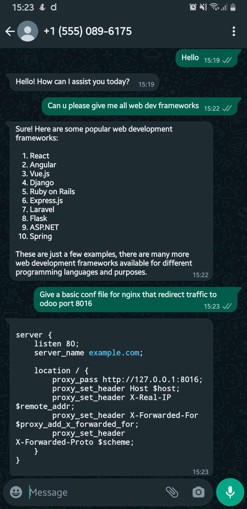

## Documentation du bot WhatsApp

### **Introduction**

Ce document décrit la création d'un bot WhatsApp en utilisant l'API Meta Cloud et Python, en particulier Flask. Nous intégrerons également des événements webhook pour recevoir des messages en temps réel et utiliserons OpenAI pour générer des réponses basées sur l'IA. Pour plus d'informations sur la structure de l'application Flask, veuillez consulter la documentation de Flask.

### **Prérequis**

* Un compte développeur Meta : Si vous n'en avez pas, vous pouvez en créer un ici : [https://developers.facebook.com/](https://developers.facebook.com/).
* Une application d'entreprise Meta : Si vous n'en avez pas, vous pouvez apprendre à en créer une ici : [https://www.facebook.com/business/help/1710077379203657](https://www.facebook.com/business/help/1710077379203657). Si vous ne voyez pas l'option de création d'une application d'entreprise, sélectionnez Autre > Suivant > Entreprise.

### **Structure du projet**

```
.
├── app
│   ├── __init__.py
│   ├── config.py
│   ├── decorators
│   │   └── security.py
│   ├── models.py
│   ├── services
│   │   ├── __init__.py
│   │   └── openai_service.py
│   ├── urls.py
│   ├── utils.py
│   └── views.py
└── run.py
```

### **Partie Webhook**

Dans cette partie, nous allons créer un webhook pour écouter les réponses envoyées par l'API WhatsApp Messenger.

**Qu'est-ce qu'un webhook ?**

Un webhook peut être considéré comme un type d'API piloté par des événements plutôt que par des requêtes. Au lieu qu'une application demande à une autre de recevoir une réponse, un webhook est un service qui permet à un programme d'envoyer des données à un autre dès qu'un événement particulier se produit. Les webhooks sont simplement un moyen pour votre compte en ligne de s'écouter et de vous informer automatiquement sans que vous ayez à faire aucun effort.

**Ngrok**

Dans ce tutoriel, nous utiliserons ngrok comme webhook. Ngrok est un outil de tunneling populaire utilisé pour exposer une application locale en cours d'exécution sur Internet. Votre machine de développement peut être connectée à un réseau sécurisé derrière un pare-feu. Pour contourner les restrictions d'accès, ngrok exécute un petit processus client sur votre machine, créant un tunnel de connexion privé au service cloud. Votre serveur de développement localhost est mappé à un sous-domaine ngrok.io, auquel un utilisateur distant peut alors accéder. Il n'est pas nécessaire d'exposer les ports, de configurer le transfert de port ou d'apporter d'autres modifications au réseau.

Nous utiliserons donc ngrok pour exposer notre hôte local sur le Web et il nous fournira l'URL "https://" que nous pouvons utiliser pour recevoir la réponse du webhook.

### **Partie Flask App (écouteur API)**

Dans cette partie, nous allons créer un écouteur webhook en utilisant Flask, puis utiliser ngrok pour obtenir un lien "https://".

### **Partie LLM**

Dans cette partie, nous créerons un client OpenAI ChatGPT pour interagir et générer une réponse ou une action.

**Conclusion**

Ce document fournit une base pour la création d'un bot WhatsApp fonctionnel utilisant l'API Meta Cloud, Flask et OpenAI. N'hésitez pas à l'étendre et à l'adapter à vos besoins spécifiques.



